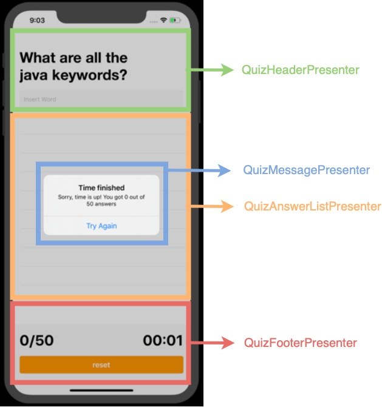
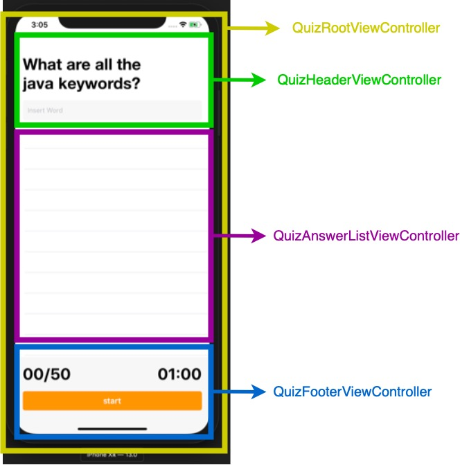
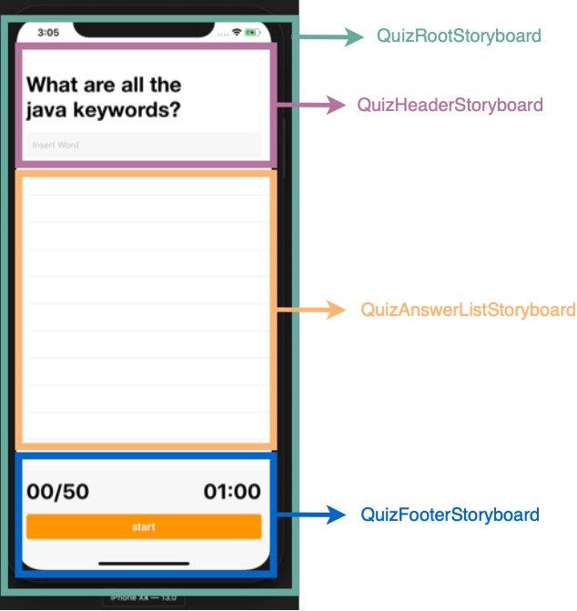

# Quiz Mobile App

[](https://travis-ci.com/mauriciomaniglia/quiz-mobile-app)

## Use Cases

### Load Question From Remote Use Case

#### Data:
- URL

#### Primary course (happy path):
1. Execute "Load Question" command with above data.
2. System downloads data from the URL.
3. System validates downloaded data.
4. System creates question from valid data.
5. System delivers question and correct answers.

#### Invalid data – error course (sad path):
1. System delivers invalid data error.

#### No connectivity – error course (sad path):
1. System delivers connectivity error.

### Start Game Use Case

#### Primary course:
1. Execute "Start" command.
2. System starts the counter.
3. System enables the user to insert guesses.

### Add User Guess Use Case

#### Data:
- String

#### Primary course:
1. Execute "Add guess" command with the above data.
2. System validates the user guess
3. System saves the user guess.

### Finish Game Use Case

#### Primary course:
1. Execute "Validate user guesses" command with the above data.
2. System verify the user guesses.
3. System informs if the game is finished.

## Architecture


## Presenter components



## ViewControllers components



## Storyboards components




### Payload contract

```
GET *url* 

200 RESPONSE

{
  "question": "What are all the java keywords?",
  "answer": [
    "abstract",
    "assert",
    "boolean",
    "break",
    "byte",
    "case",
    "catch",
    "char",
    "class",
    "const",
    "continue",
    "default",
    "do",
    "double",
    "else",
    "enum",
    "extends",
    "final",
    "finally",
    "float",
    "for",
    "goto",
    "if",
    "implements",
    "import",
    "instanceof",
    "int",
    "interface",
    "long",
    "native",
    "new",
    "package",
    "private",
    "protected",
    "public",
    "return",
    "short",
    "static",
    "strictfp",
    "super",
    "switch",
    "synchronized",
    "this",
    "throw",
    "throws",
    "transient",
    "try",
    "void",
    "volatile",
    "while"
  ]
}
```
