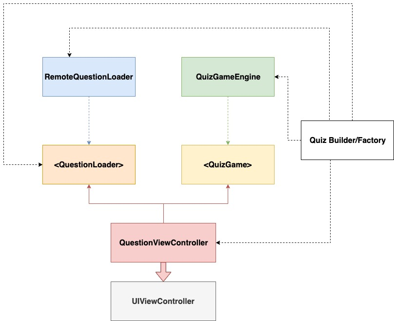

# Quiz Mobile App

## BDD Specs

### Story: Customer request to load the game

### Narrative #1

```
As an online customer
I want the app to automatically load the quiz game
So I can see the game ready to be play
```

#### Scenarios (Acceptance criteria)

```
Given the customer has connectivity
 When the customer requests to load the game
 Then the app should display the question from remote
  And the customer can start to play
```

### Story: Customer request to start the game

### Narrative #1

```
As an online customer
I want to start the game
So I can starts to play
```

#### Scenarios (Acceptance criteria)


```
Given the app has already loaded the question
When the customer requests to start the game
Then the app should allow the customer to insert answers

Given the app has already loaded the question
 When the customer requests to start the game
 Then the counter should starts to count  
 
 Given the app has already loaded the question
 When the customer requests to start the game
 Then the app should show the amount of answers that the customer hit
 And the total of answers to be guessed
 
```

### Story: Customer insert a new answer

### Narrative #1

```
As an online customer
I want to add an answer
So I can start to guess all the correct answers before the counter ends
```

#### Scenarios (Acceptance criteria)

```
Given the customer has already requested to start the game
 When the customer insert a new answer
 Then the app should display a list with all answers inserted by the customer
  And the app should update the remaining answers to be guessed

Given the customer has already requested to start the game
 When the customer finished inserting all answers to be guessed
  And the timer has not finished yet
 Then the app should display a message showing how many answers the customer hit
  And the option to play again
```

### Story: Customer request to restart the game

### Narrative #1

```
As an online customer
I want to restart the game
So I can start another round
```

#### Scenarios (Acceptance criteria)

```
Given the customer has already requested to start the game
 When the customer requests to reset the game
 Then the counter should reset 
  And the list with all customer's guesses should be deleted
  
Given the customer has already requested to start the game
 When the customer requests to reset the game
 Then the app should not allow the customer insert new answers until it starts again

Given the customer finished answering all guesses before the timer ends
 When the customer request to play again from the message shown by the app
 Then the counter should reset 
  And all previous answers should be deleted

Given the customer has not finished answering all guesses 
  And the counter ends
 When the customer request to play again from the message shown by the app
 Then the counter should reset 
  And the list with all customer's guesses should be deleted
```

### Story: Game finished

### Narrative #1

```
Given the customer has already requested to start the game
When the customer do not finished answering all the guesses
 And the counter ends
Then the app should display a message indicating the time is over and how many answers the customer hit
 And show the option to try another again
 
Given the customer has already requested to start the game
 When the customer finished inserting all answers to be guessed
  And the timer has not finished yet
 Then the app should display a message showing how many answers the customer hit
  And the option to play again
```

## Use Cases

### Load Question From Remote Use Case

#### Data:
- URL

#### Primary course (happy path):
1. Execute "Load Question" command with above data.
2. System downloads data from the URL.
3. System validates downloaded data.
4. System creates question from valid data.
5. System delivers question and correct answers.

#### Invalid data – error course (sad path):
1. System delivers invalid data error.

#### No connectivity – error course (sad path):
1. System delivers connectivity error.

### Start Game Use Case

#### Data:
- Counter

#### Primary course:
1. Execute "Start Game" command with the above data.
2. System starts the counter.
4. Counter delivers current seconds.
5. System delivers game current state.

### Restart Game Use Case

#### Primary course:
1. Execute "Restart Game" command.
2. System deletes old answers.
3. System stops the counter.
4. System resets the counter.
5. System delivers game current state.

### Add Answer Use Case

#### Data:
- String

#### Primary course:
1. Execute "Add Answer" command with the above data.
2. System validates answer
3. System saves new answer.
4. System delivers game current state

### Validate Answers Use Case

#### Primary course:
1. Execute "Validate Answers" command with the above data.
2. System valides if all saved answers is equal to the total correct answers that came from server.
3. System stop the counter.
4. System delivers game current state

## Architecture




### Payload contract

```
GET *url* 

200 RESPONSE

{
  "question": "What are all the java keywords?",
  "answer": [
    "abstract",
    "assert",
    "boolean",
    "break",
    "byte",
    "case",
    "catch",
    "char",
    "class",
    "const",
    "continue",
    "default",
    "do",
    "double",
    "else",
    "enum",
    "extends",
    "final",
    "finally",
    "float",
    "for",
    "goto",
    "if",
    "implements",
    "import",
    "instanceof",
    "int",
    "interface",
    "long",
    "native",
    "new",
    "package",
    "private",
    "protected",
    "public",
    "return",
    "short",
    "static",
    "strictfp",
    "super",
    "switch",
    "synchronized",
    "this",
    "throw",
    "throws",
    "transient",
    "try",
    "void",
    "volatile",
    "while"
  ]
}
```
